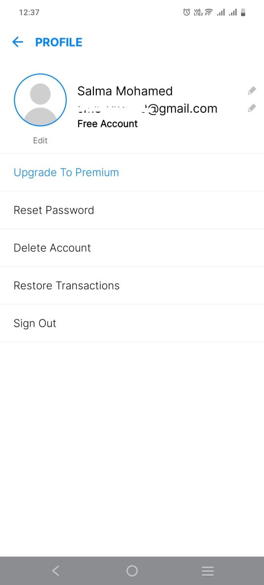
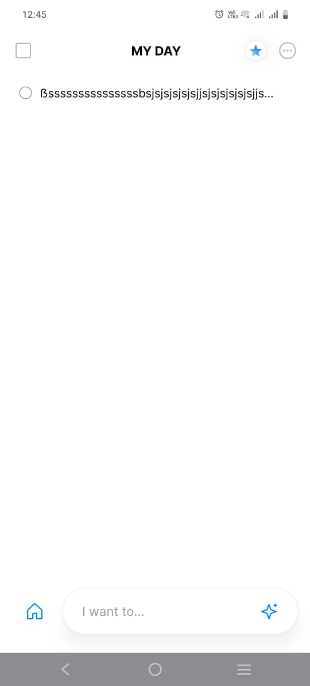
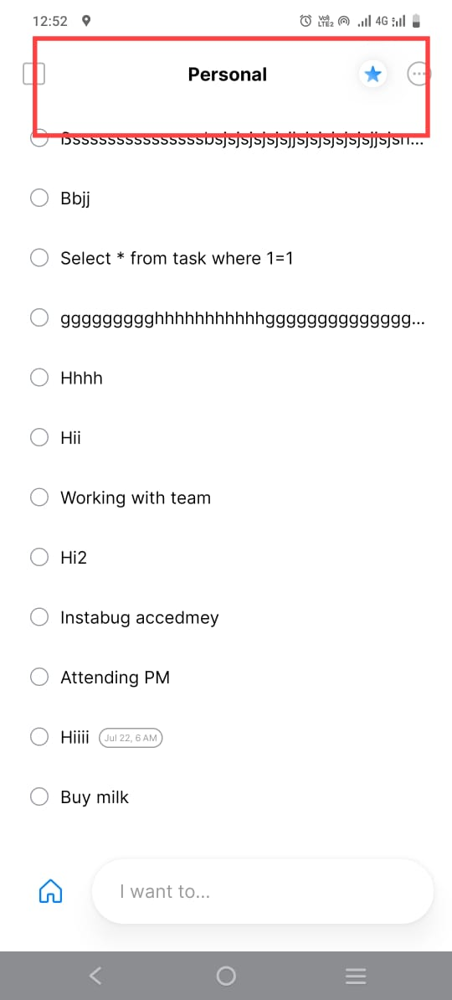

# Test Design  

| Designed By    | Salma Mohamed                                                                                           |             |                                                      |               |                                                                                                                                                                          |                                                                                                                                                                                                             |                                                                                                                                                                                                                                                                                        |                                                                    |                                           |                                                                                                                             |                                                                                                                |        |           |
|:--------------:|:-------------------------------------------------------------------------------------------------------:|:-----------:|:----------------------------------------------------:|:-------------:|:------------------------------------------------------------------------------------------------------------------------------------------------------------------------:|:-----------------------------------------------------------------------------------------------------------------------------------------------------------------------------------------------------------:|:--------------------------------------------------------------------------------------------------------------------------------------------------------------------------------------------------------------------------------------------------------------------------------------:|:------------------------------------------------------------------:|:-----------------------------------------:|:---------------------------------------------------------------------------------------------------------------------------:|:--------------------------------------------------------------------------------------------------------------:|:------:|:---------:|
| Requirement ID | Requirement Description                                                                              | Scenario ID | Scenario Description                              | Test cases ID | TC Description                                                                                                                                                           | Pre-Condition                                                                                                                                                                                               | Test Steps                                                                                                                                                                                                                                                                             | Test Data                                                          | Type                                      | Expected Result                                                                                                             | Actual Result                                                                                                  | Status | Priority  |
| R1             | The app should install correctly and launch  without issues.                                         | S1.1        | Verify App Installation and  Launch               | TC1.1.1       | Verify app installation and launch on  Android/IOS                                                                                                                    | 1. Device is running Android/IOS. 2. Valid Google/Apple account credentials are available.                                                                                                            | 1. Open Google/Apple Store. 2. Search for ""Any.do"". 3. Download and install the app. 4. Launch the app.                                                                                                                                                                     | N/A                                                                | Installation                              | The app installs without errors and  launches to login screen.                                                           | The app installs without errors and  launches to login screen.                                              | Passed | High      |
| R2             | The app should NOT install with Low Storage                                                             | S2.1        | Device has insufficient  storage space.           | TC2.1.1       | Verify that the installation fails gracefully  when there is insufficient storage on an Android/IOS device.                                                           | 1. Device is running Android/IOS. 2. Valid Google/Apple account credentials are available.                                                                                                            | 1.Open Google Play Store. 2.Search for ""Any.do"". 3.Attempt to download and install the app.                                                                                                                                                                                    | N/A                                                                | Installation                              | The installation should fail with an appropriate  error message indicating insufficient storage space.                   |                                                                                                                |        | Low       |
| R3             | Users should be able to log in using their  email credentials/Facebook account/ Google account | S2.1        | Successful login using  Google account            | TC3.1.1       | Verify that the user can log in with  a valid Google account (Fill all fields with valid Data)                                                                     | 1. Device is running Android . 2. Valid Google account credentials are available. 3. Any.do app is installed from Google Play Store. link: https://play.google.com/store/apps/details?id=com.anydo | 1. Open Any.do  App for aAdroid device 2. click on continue with Google 3. Select your Google Account                                                                                                                                                                            | Email:salma.QA@gmail.com password:113sss                        | Funcational                               | Login successfully  & showing name ,  email and profile picture for Google account                                    | Not showing the profile picture  for Google account                                                         | Failed | High      |
| R3             | Users should be able to log in using their  email credentials/Facebook account/ Google account | S2.2        | Successful login using  Facebook account          | TC3.1.2       | Verify that the user can log in with  a valid facebook account (Fill all fields with valid Data)                                                                   | 1. Device is running Android . 2. Valid Google account credentials are available. 3. Any.do app is installed from Google Play Store. link: https://play.google.com/store/apps/details?id=com.anydo | 1. Open Any.do  App for Anroid device 2. Click on Facebook Icon 3. Confirm your Facebook Account                                                                                                                                                                                 | Email:salma.QA@yahoo.com password:113sss                        | Funcational                               | Login successfully  & showing name ,  email and profile picture for Facebook account                                  | Login successfully  & showing name ,  email and profile picture for Facebook account                     | Passed | High      |
| R3             | Users should be able to log in using their  email credentials/Facebook account/ Google account | S2.3        | Successful login using  Email credentials         | TC3.1.3       | Verify that the user can log in with  a valid Email credentials (Fill all fields with valid Data)                                                                  | 1. Device is running Android . 2. Valid Google account credentials are available. 3. Any.do app is installed from Google Play Store. link: https://play.google.com/store/apps/details?id=com.anydo | 1. Open Any.do  App for Anrdoid device 2. Click on Email Icon 3. Add email  4. add Name 5. Enter Password                                                                                                                                                                  | Email:salma.QC@gmail.com Name:Salma Mohamed Pasword:113Saaaa | Funcational                               | Login successfully  & showing name and email that the User entered                                                    | Login successfully  & showing name and email that the User entered                                       | Passed | High      |
| R4             | User must be able to add new tasks                                                                      | S4.1        | Verify Adding a New Task to  the To-Do List       | TC4.1.1       | Add new task                                                                                                                                                             | 1. Device is running Android . 2. Valid Google account credentials are available. 3. Any.do app is installed from Google Play Store. link: https://play.google.com/store/apps/details?id=com.anydo | 1. Open app  2. Log in  3. Navigate to the main screen  4. Tap ""Add Task""  5. Enter task details 6. Click on save task                                                                                                                                                | N/A                                                                | Funcational                               | New task is added to the to-do list  and displayed on the main screen                                                    | New task is added to the to-do list  and displayed on the main screen                                       | Passed | High      |
| R4             | User must be able to add new tasks                                                                      | S4.2        | Verify Adding a New Task to  the To-Do List       | TC4.1.2       | Add new task - without custom date                                                                                                                                       | 1. Device is running Android . 2. Valid Google account credentials are available. 3. Any.do app is installed from Google Play Store. link: https://play.google.com/store/apps/details?id=com.anydo | 1. Open app  2. Log in  3. Navigate to the main screen  4. Tap ""Add Task""  5. Enter task details without custom date  6. Click on save task                                                                                                                           | N/A                                                                | Funcational                               | New task is added to the to-do list Under today Tasks  and displayed on the main screen                                  | New task is added to the to-do list Under today Tasks  and displayed on the main screen                     | Passed | Medium    |
| R5             | Task title should have character limits                                                                 | S5.1        | Verify Boundary Conditions  for Task Title        | TC5.1.1       | Task title with excessive length                                                                                                                                         | 1. Device is running Android . 2. Valid Google account credentials are available. 3. Any.do app is installed from Google Play Store. link: https://play.google.com/store/apps/details?id=com.anydo | 1. Open app  2. Log in  3. Navigate to the main screen  4. Tap ""Add Task""  5. Enter a very long title  6. Click on save task                                                                                                                                          | N/A                                                                | Funcational                               | Error message prompts user about title length limit                                                                         | Not showing any error message                                                                                  | Failed | Medium    |
| R6             | The app should handle interruptions  from incoming calls properly and maintain its state.            | S6.1        | Verify App Functionality  During Incoming Calls   | TC6.1.1       | Ensure that the app handles interruptions  from incoming calls properly.                                                                                              | 1. Device is running Android . 2. Valid Google account credentials are available. 3. Any.do app is installed from Google Play Store. link: https://play.google.com/store/apps/details?id=com.anydo | 1. Open the Any.do the app and start using it. 2. Receive an incoming call during wright title for Task. 3. End the call and return to the app.                                                                                                                                  | n/a                                                                | Funcational                               | The app resumes correctly and  maintains the state it was in before the call.                                            | The app resumes correctly and  maintains the state it was in before the call.                               | Passed | Medium    |
| R7             | Global user base                                                                                        | S7.1        | Localization and Internationalization                | TC7.1.1       | Verify the app's functionality in different languages  and regions to ensure that all content is properly  localized and formatted according to regional settings. | 1. Device is running Android . 2. Valid Google account credentials are available. 3. Any.do app is installed from Google Play Store. link: https://play.google.com/store/apps/details?id=com.anydo | 1. Open the app. 2. Log in with valid credentials. 3. Change Language and Region Settings: 4. Navigate to the device's settings. 5. Change the language and region settings to a different language (e.g., from English (US) to French (France)). 6. Return to the app. | N/A                                                                | Localization and  Internationalization | All app content (e.g., menus, buttons, labels, messages) is  displayed in the selected language.                         | All app content (e.g., menus, buttons, labels, messages) is  displayed in the selected language.            | Passed | Medium    |
| R8             | Task Search                                                                                             | S8.1        | Task Search in All Tasks and Events                  | TC8.1.1       | Verify that the user can search for tasks and  events across all lists.                                                                                               | 1. Device is running Android . 2. Valid Google account credentials are available. 3. Any.do app is installed from Google Play Store. link: https://play.google.com/store/apps/details?id=com.anydo | 1.Add tasks 2. Navigate to the search feature in the app. 3.Enter a keyword that matches one of the task titles or event descriptions. 4.Observe the search results.                                                                                                          | N/A                                                                | Funcational                               | The app should display tasks and events  that match the search keyword across all lists.                                 | The app should display tasks and events  that match the search keyword across all lists.                    | Passed | Medium    |
| R8             | Task Search                                                                                             | S8.2        | Task Search within a Specific List                   | TC8.2.1       | Verify that the user search within a specific list  if the app does support this functionality.                                                                       | 1. Device is running Android . 2. Valid Google account credentials are available. 3. Any.do app is installed from Google Play Store. link: https://play.google.com/store/apps/details?id=com.anydo | 1. Try to use the search feature within the specific list. 2. Observe if the app allows the search or restricts it.                                                                                                                                                              | N/A                                                                | Funcational                               | The app should allow search functionality  within the specific list                                                      | The app NOT allow search  functionality within the specific list                                            | Failed | Low       |
| R9             | Rotate Device to Landscape Mode                                                                         | S9.1        | Rotate Device from portal mode to  Landscape Mode | TC9.1.1       |  verify that the app maintains  the same status and correctly displays content  after the device is rotated to landscape mode.                                     | 1. Device is running Android . 2. Valid Google account credentials are available. 3. Any.do app is installed from Google Play Store. link: https://play.google.com/store/apps/details?id=com.anydo | 1. Navigate to a specific screen( Any list view) 2. Rotate the device to landscape mode.                                                                                                                                                                                            | N/A                                                                | Usability                                 | the current status of the screen is preserved  after rotating to landscape mode.                                         | App back to home screen after roated                                                                           | Failed | Medium    |
| R10            |                                                                                                         | S10.1       | Verify Completed Tasks in Settings                   | TC10.1.1      | Verify that tasks marked as completed  are correctly displayed in the  ""Completed Tasks"" section under settings.                                                 | 1. Device is running Android . 2. Valid Google account credentials are available. 3. Any.do app is installed from Google Play Store. link: https://play.google.com/store/apps/details?id=com.anydo | 1. Create a new task with a specific title  2. Mark the newly created task as completed. 3. Open the app menu and navigate to the settings section. 4. Click on the ""Completed Tasks"" option under settings.                                                             | N/A                                                                | Funcational                               | The task marked as completed (""Test Task"")  should be listed in the ""Completed Tasks"" section.                       | No tasks are displayed in the ""Completed Tasks""  section, even though tasks have been marked as completed | Failed | High      |
| R11            | Permissions for access media                                                                            | S11.1       | Verify App Requests Permission                       | TC11.1.1      | Verify App Requests Permission to  Add Photos from Gallery                                                                                                            | 1. Device is running Android . 2. Valid Google account credentials are available. 3. Any.do app is installed from Google Play Store. link: https://play.google.com/store/apps/details?id=com.anydo | 1. Navigate to task 2. Navigate to add file 2. Select the option to add a photo from the gallery.                                                                                                                                                                             | N/A                                                                | Functional, Security                              | The app should prompt the user for permission to  access the device's photos  if permission has not been granted yet. | The app does not request permission to access  photos and fails to add photos from the gallery.          | Failed | High      |

--- 

# Bug Reports 

| Designed By      | Salma Mohamed                                                                                                                 |                                                                                                                                                                                                             |                                                                                                                                                                                                                             |                                                |                                                                                                                                        |                                                                                                                                            |        |                      |          |                                                                                                                                                                                                                                                                                   |            |          |          |
|:----------------:|:-----------------------------------------------------------------------------------------------------------------------------:|:-----------------------------------------------------------------------------------------------------------------------------------------------------------------------------------------------------------:|:---------------------------------------------------------------------------------------------------------------------------------------------------------------------------------------------------------------------------:|:----------------------------------------------:|:--------------------------------------------------------------------------------------------------------------------------------------:|:------------------------------------------------------------------------------------------------------------------------------------------:|:------:|:--------------------:|:--------:|:---------------------------------------------------------------------------------------------------------------------------------------------------------------------------------------------------------------------------------------------------------------------------------:|:----------:|:--------:|:--------:|
| Affected Devices | Android OS14                                                                                                                  |                                                                                                                                                                                                             |                                                                                                                                                                                                                             |                                                |                                                                                                                                        |                                                                                                                                            |        |                      |          |                                                                                                                                                                                                                                                                                   |            |          |          |
| BUG-ID           | Description                                                                                                                   | Pre-Condition                                                                                                                                                                                               | Test Steps                                                                                                                                                                                                                  | Test Data                                      | Expected Result                                                                                                                        | Actual Result                                                                                                                              | Status | Type                 | Attachment | Impact                                                                                                                                                                                                                                                                            | TC-Related | Priority | Severity |
| Bug-001          | Google Account Profile Picture  Not Displayed Upon Login                                                                   | 1. Device is running Android . 2. Valid Google account credentials are available. 3. Any.do app is installed from Google Play Store. link: https://play.google.com/store/apps/details?id=com.anydo | 1. Open the Any.do app on the Android device. 2. Click on ""Continue with Google.""  3. Select a valid Google account.                                                                                             | Email: salma.QA@gmail.com  Password: 113sss | The app should log in successfully and  display the user's name, email, and profile picture  associated with the Google account. | The app logs in successfully  and displays the user's name and email,  but does not show the profile picture for the Google account. | open   | Funcational          |     |  User Experience: The absence of the profile  picture diminishes the personalized experience  expected by users, potentially reducing  user satisfaction and engagement.                                                                                                 | TC3.1.1    | Medium   | Medium   |
| Bug-002          | Task Title Length Limit Not Enforced                                                                                          | 1. Device is running Android . 2. Valid Google account credentials are available. 3. Any.do app is installed from Google Play Store. link: https://play.google.com/store/apps/details?id=com.anydo | 1. Open app  2. Log in  3. Navigate to the main screen  4. Tap ""Add Task""  5. Enter a very long title  6. Click on save task                                                                               | N/A                                            | An error message should prompt  the user about the title length limit.                                                              | No error message is shown,  allowing the task title to exceed the character limit.                                                      | New    | Funcational          |       | 1.User Experience: Users might enter excessively  long task titles without knowing there is a limit,  leading to potential data truncation or display issues. 2.Data Integrity: Lack of enforcement can result in  inconsistent data entries and potential UI issues. | TC5.1.1    | High     | Medium   |
| Bug-003          | Search functionality is not available within specific list                                                                 | 1. Device is running Android . 2. Valid Google account credentials are available. 3. Any.do app is installed from Google Play Store. link: https://play.google.com/store/apps/details?id=com.anydo | 1. Try to use the search feature within the specific list. 2. Observe if the app allows the search or restricts it.                                                                                                   | N/A                                            | The app should allow search functionality  within the specific list                                                                 | The app NOT allow search  functionality within the specific list                                                                        | New    | Funcational          |        | Reduced Efficiency: Users rely on search functionality to  quickly find tasks within a specific list. Without this feature,  users have to manually scan through the list,  which is time-consuming, especially if the list is lon                                       | TC8.2.1    | Medium   | Low      |
| Bug-004          | the app cannot maintain the same  status and correctly displays content after  the device is rotated to landscape mode. | 1. Device is running Android . 2. Valid Google account credentials are available. 3. Any.do app is installed from Google Play Store. link: https://play.google.com/store/apps/details?id=com.anydo | 1. Navigate to a specific screen( Any list view) 2. Rotate the device to landscape mode.                                                                                                                                 | N/A                                            | the current status of the screen is preserved  after rotating to landscape mode.                                                    | App back to the home screen after rotated  to Landscape mode                                                                            | New    | Usability            |        | Disruption in Workflow: Users are interrupted and  have to navigate back to the intended screen, causing inconvenience.                                                                                                                                                        | TC9.1.1    | Medium   | Medium   |
| Bug-005          | tasks marked as completed are NOT displayed  in the ""Completed Tasks"" section under settings.                            | 1. Device is running Android . 2. Valid Google account credentials are available. 3. Any.do app is installed from Google Play Store. link: https://play.google.com/store/apps/details?id=com.anydo | 1. Create a new task with a specific title  2. Mark the newly created task as completed. 3. Open the app menu and navigate to the settings section. 4. Click on the ""Completed Tasks"" option under settings.  | N/A                                            | The task marked as completed  should be listed in the ""Completed Tasks"" section.                                                  | No tasks are displayed in the ""Completed Tasks""  section, even though tasks have been marked as completed                             | New    | Funcational          | f        | Users are unable to verify the completion of tasks,  leading to confusion and reduced trust in the app's functionality.                                                                                                                                                        | TC10.1.1   | High     | High     |
| Bug-006          | App does not request permission  to add photos from the gallery                                                            | 1. Device is running Android . 2. Valid Google account credentials are available. 3. Any.do app is installed from Google Play Store. link: https://play.google.com/store/apps/details?id=com.anydo | 1. Navigate to task 2. Navigate to add file 2. Select the option to add a photo from the gallery.                                                                                                                  | N/A                                            | The app should prompt the user for permission to  access the device's photos if permission  has not been granted yet.            | The app does not request permission to  access photos and fails to add photos from the gallery.                                         | New    | Functional, Security | f        | Security Risk: The app bypasses  standard security protocols  designed to protect user data and privacy,  which can lead to potential privacy violations and decreased user trust.                                                                                       | TC11.1.1   | High     | High     |

